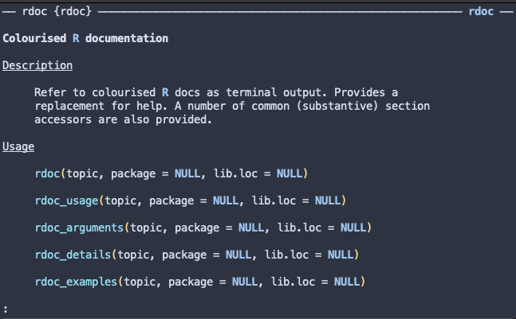

# rdoc
[](https://travis-ci.org/mdequeljoe/rdoc)
[](https://cran.r-project.org/package=rdoc)
[](https://codecov.io/gh/mdequeljoe/rdoc)
[](https://www.tidyverse.org/lifecycle/#maturing)

rdoc = `help` + `tools::Rd2txt` + [cli](https://github.com/r-lib/cli) + [crayon](https://github.com/r-lib/crayon) + [prettycode](https://github.com/r-lib/prettycode)




Whilst primarily intended for usage in a terminal, `rdoc` can also be used sensibly elsewhere (such as Rstudio) whereby the output will be printed by sections to avoid flooding it with too much text.

## install

(work in progress)
```r
devtools::install_github("mdequeljoe/rdoc")
```

## replacing `help` and `?`

`help` and `?` can be overridden via:

```r
rdoc::use_rdoc()
```

Returning to the base functions is possible with:

```r
rdoc::rm_rdoc()
```

